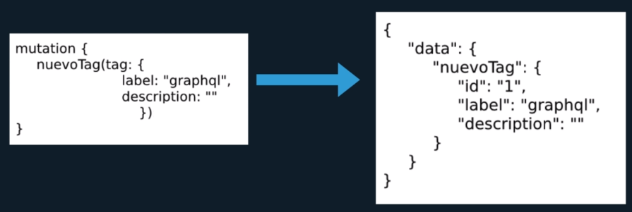

1. [Esquema GraphQL](#schema)
2. [Scalar Types](#scalar)
3. [Object Types](#object)
4. [Enum Types](#enum)
5. [Type Modifiers](#modifiers)
6. [Interfaces](#interfaces)
7. [Root Types](#root)
8. [Input Types](#input)
9. [Comentarios](#comments)
10. [Merge, alias y fragment](#maf)
11. [Query Variables](#variables)
12. [Include y skip](#is)

# 1. Esquema GraphQL
- Centro de cualquier implementación del servidor del GraphQL.
- Sin el esquema mo podemos contruir la API.
- Es la parte más compleja de un proyecto GraphQL.
- Nos alejamos de la filosofía de las API REST.

## Definición y diseño
- Definido por los tipos y directivas que admite.
- Tipos de operación que admite:
    - Query.
    - Mutation.
    - Subscription.

## Reglas de validación interna
- Nombres únicos en tipos.
- Nombres de directivas únicos.
- Tipos y directivas no pueden comenzar con dos guiones bajos.

## Convenciones
- Nombres de campos en camelCase.
- Nombres de tipos en PascalCase.
- Enums:
    - Nombres de tipo en PascalCase.
    - Valores en ALL_CAPS.

# 2. Scalar Types
- Datos primitivos que pueden almacenar un solo valor.
- Con los tipos de objeto y tipo de raíz imprescindible.
- Define la mayoría de las propiedades de las entidades.

## Tipos predeterminados
- **Int:** números enteros.
- **Float:** números con decimales.
- **String:** cadena de caracteres.
- **Boolean:** Verdadero/falso.
- **ID:** Identificador único (Int o String).

## Escalares personalizados
- Se define en el schema.graphql
- Añadir en el *resolver* de tipos.
- Implementar con el *GraphQLScalarType*.
- Definir las propiedades *parseValue, serialize y parseLiteral*.

# 3. Object types

- Entidades con las que modelamos y estructuramos los servicios.
- Objetos personalizados que definen cómo se verá en la API.
- Se pueden definir tantos tipos como se desee.
- Todos los tipos deben de tener campos.

## Ejemplo

~~~
// schema.graphql
type Profesor {
    nombre: String
    apellidos: String
    experiencia: Int
}
type Asignatura {
    id: ID
    nombre: String
    horasLectivas: Int
    profesor: Profesor
}
~~~

# 4. Enum Types
- Similar a un tipo scalar.
- Útiles para trabajar con una lista de valores predefinidos.
- Para crear un enum dentro del schema usar "enum" en lugar de "type".

## Ejemplo
~~~
type Profesor {
    nombre: String
    apellidos: String
    experiencia: Int
    curso: Cursos=NPM
}
enum Cursos {
    GRAPHQL_DE_CERO
    NPM
    COMPODOC
}
~~~

# 5. Type Modifiers
- Sirven para modificar el comportamiento cuando usamos un tipo.
- **!:** Indica valor obligatorio.
- **[]:** Lista de valores con un elemento o más.

## Ejemplo
~~~
type Profesor {
    nombre: String!
    cursos1: [String] //Lista
    cursos2: [String]! //Lista no puede ser null
    cursos3: [String!] // Lista puede ser null, pero sus valores no pueden ser null
    cursos4: [String!]! //Ni la lista ni los valores pueden ser null
}
~~~

# 6. Interfaces
- Definiciones abstractas de atributos comunes.
- Útiles para retornar obhetos de diferentes tipos.
- Necesarias cuando buscamos acceder a cierto grupo de objetos que deben cumplir con las propiedades definidas por la interfaz.
- Abstraemos grupos de tipos sobre ellos como una entidad.

## Ejemplo
~~~
interface Perfil {
    nombre: String!
    email: String!
    edad: Int!
}
type Alumno implements Perfil {
    nombre: String!
    email: String!
    edad: Int!
    curso: String
}
~~~

# 7. Root Types
- Son puntos de entrada.
Sirven para comunicar al cliente con el servidor a través de ellos.
- Tipos
    - **Query:** Consulta (en REST => GET).
    - **Mutation:** Modificación (en REST => POST, PATCH, PUT, DELETE).
    - **Subscription:** Suscripción. Interacción de info en tiempo real.

## Query
- Punto de entrada para realizar las consultas.
- Similar a pedir un recurso en la API basada en REST.
- Tipo de consulta desde cliente a servidor.
- Escrito en lenguaje SDL para definir la consulta.
- Es el único tipo de raiz que es obligatorio.
- Es la única forma en que podemos obtener datos en GraphQL.

## Mutation
- Punto de entrada para realizar las operaciones de modificación.
- Equivalente en REST a POST, PUT, PATCH Y DELETE.
- Similar a una función.
- Es la única forma en que podemos modificar datos en GraphQL.

## Subscription
- Punto de entrada para obtener información en tiempo real.
- Utiliza la conexión mediante Web Sockets para obtener cambios.
- Notifica al que se suscribe y mantiene interacción en tiempo real.

# 8. Input Types
- Elementos que permiten pasar valores a Queries/Mutations.
- Se pueden pasar valores simples (escalares) u objetos complejos.
- Se comporta como los argumentos ante cualquier operación.

# 9. Comentarios
- Podemos documentar nuestras APIs añadiendo comentarios en el schema.
- GrapQL admite markdown dentro del schema para comentarios.
- Tipos
    - **Una línea:** Comillas dobles.
    - **Varias líneas:** Triples comillas dobles.
- Facilita la generación de SDL.

# 10. Merge, Alias y Fragment
## Merge
Si realizamos dos consultas en paralelo sobre la misma instancia el resultado será una mezcla de ambas consultas.

## Alias
Para poder realizar dos consultas en paralelo sobre la misma instancia con distintos argumentos, es necesario el uso de alias.

## Fragment
Es posible separar partes comunes a varias consultas mediante fragments, de forma que no repitamos código.

# 11. Query Variables
Es posible parametrizar argumentos utilizando query variables.

# 12. Include y skip
Estas directivas permiten incluir o excluir campos en una consulta de forma parametrizada.

